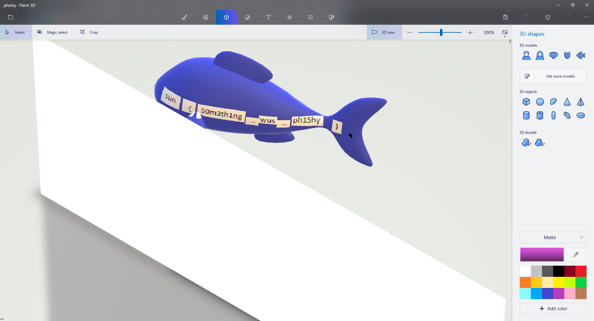

Phishy
======

We're given a ZIP archive which the problem description hints quite
strongly is a Paint 3D project. Strangely, Paint 3D doesn't actually
provide a way for you to export and import projects to disk -- it
requires you to use some online service to share them to other
people.

So the first step is to figure out how to import these files. The
problem description also gives a hint at where projects are saved.
We can create a couple of new projects in Paint 3D to get a feel for
how things are supposed to be. We quickly find there's a separate
folder for each project, with a top level projects.json listing each
one. We drop the phishy folder in and add an entry to projects.json.

Success! We can see the phishy project in our project list now. But
not so fast... we get an error if we try to open it. So now we have
to start diving in to what all these different files do.

The best way to find out what's what is to make modifications to a
normal Paint 3D project, then investigate what happens to the files.
Check if files are removed/deleted, take md5sums to see if files
changed, etc. For the most part the rest of this challenge is just
trying random stuff until we happen upon what we need. We can also
watch it in procmon to investigate in broad terms how it accesses
files.

We discover the following:

1. When loading a project it just reads in the whole directory. It
doesn't load files one at a time based on the contents of other
files.

1. Each 3d object gets a number of Nodes_nnnnn_xxxx.bin files:
AxisAlignmentProvider, Canvas3d, MeshInstance, NodeBounds,
NodeParent, NodePRS, PhysicsComponent, SurfaceAlignmentProvider.

1. Every shape's AxisAlignmentProvider seems to be the same.

1. Moving / resizing objects mostly just affects the NodePRS.bin
file. Changing it in just one dimension helps to narrow down what
part is x axis, y axis, z axis, etc.

1. Canvas3D.bin contains a 64-bit field that corresponds to a
Resources_Heirarchies_nnn.bin, a 64-bit field that corresponds to
a Resources_SurfaceNormals_nnn.bin, and 2 64-bit fields that each
correspond to a Resources_Surfaces_nnn.bin.

1. Resources_Mesh_nnn.bin matches the number of the various
Nodes_nnn_xxx.bin files and also contains a 64-bit field internally
with that number. Nodes_nnn_MeshInstance.bin also contains that
number in its data.

Looking at the phishy project we can see if there's anything that
deviates from all these discoveries. And sure enough, we find 2
things that stick out like a sore thumb: half of that 64-bit field
from Resources_Mesh_nnn.bin has been overwritten with FISH and half
of that 64-bit field from Node_nnn_MeshInstance.bin has been
overwritten with STIK.

After correcting those fields to nnn from the filename, it opens now!
We see a model of a fish with the flag attached to the back face.

